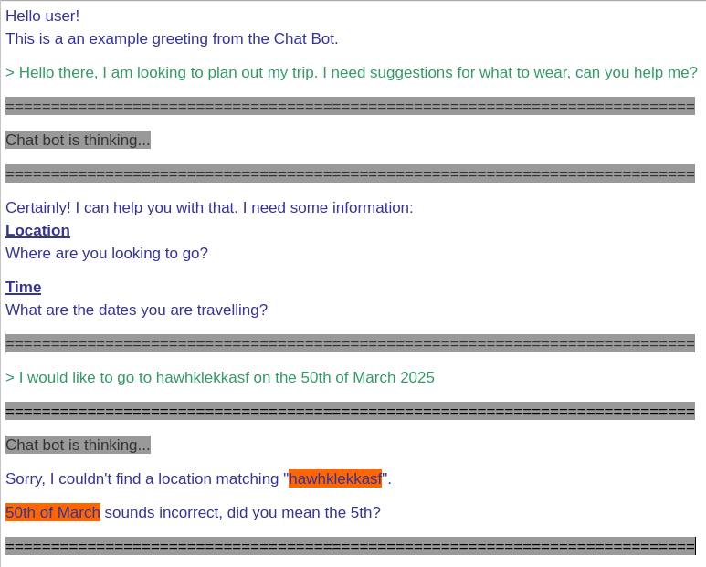

Example greeting and question from a user to the Chat Bot.
```
Hello user!
This is a an example greeting from the Chat Bot.

> Hello there, I am looking to plan out my trip. I need suggestions for what to wear, can you help me?
```

Pending response, can be a typing indicator with artificial delay.
```
Chat bot is thinking..
```

Response from the Chat Bot. It can be shown word-by-word with small delays in between to simulate a real conversation.
```
Certainly! I can help you with that.
```

If we are sticking with a terminal user interface, we can use colored text and underlines to both differentiate between user and Chat Bot and to create headings and paragraphs as responses.

See [ansi escape codes](https://en.wikipedia.org/wiki/ANSI_escape_code).

Below is an example image showing how the terminal interface could look like:

